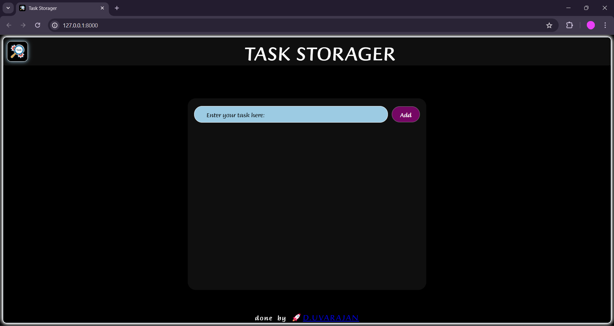

# Task Storager - To store your tasks

Task Storager is a simple and intuitive web application built with Django that allows users to manage their tasks efficiently. Users can add new tasks through an easy-to-use interface, view a list of all their tasks, and delete tasks when they are completed. All task data is stored in an SQLite database, making the application lightweight and perfect for personal use or small projects.

## Table of contents

- [Overview](#overview)
  - [Screenshot](#screenshot)
  - [Links](#links)
<!-- - [My process](#my-process) -->
  - [Built with](#built-with)
- [Installation](#installation)
  <!-- - [What I learned](#what-i-learned) -->
  <!-- - [Continued development](#continued-development) -->
  <!-- - [Useful resources](#useful-resources) -->
- [Author](#author)
<!-- - [Acknowledgments](#acknowledgments) -->

<!-- **Note: Delete this note and update the table of contents based on what sections you keep.** -->

## Overview

### Screenshot


### Links
- About Django visit: [Django](https://docs.djangoproject.com/en/5.0/)
- About me: [uvarajan.d](https://uvarajand.github.io/uvarajan/)

## My process

### Built with
- Python Django setup
- Semantic HTML5 markup
- CSS custom properties
- Flexbox

<!-- ### Useful resources -->

<!-- - [Example resource 1](https://www.example.com) - This helped me for XYZ reason. I really liked this pattern and will use it going forward.
- [Example resource 2](https://www.example.com) - This is an amazing article which helped me finally understand XYZ. I'd recommend it to anyone still learning this concept. -->

<!-- **Note: Delete this note and replace the list above with resources that helped you during the challenge. These could come in handy for anyone viewing your solution or for yourself when you look back on this project in the future.** -->
## Installation

1. **Clone the repository:**

    ```bash
    git clone https://github.com/UVARAJAND/Task_Storager.git
    cd Task-Storager
    ```

2. **Install the required dependencies:**

    ```bash
    pip install -r requirements.txt
    ```
3. **Run the development server:**

    ```bash
    python manage.py runserver
    ```

4. **Access the application:**

    Open your web browser and go to `http://127.0.0.1:8000/`.`

## **To see the tasks stored in the database**

1. **Create a superuser (optional):**

    ```bash
    python manage.py createsuperuser
    ```

2. **Django admin panel**

    Open your web browser and go to `http://127.0.0.1:8000/admin`.

3. **Admin credentials**
    ```bash
    default={
        username:"uvarajan";
        password:123456789;
    }
    ```

## Author

- Website - [UVARAJAN_D](https://uvarajand.github.io/uvarajan/index.html)